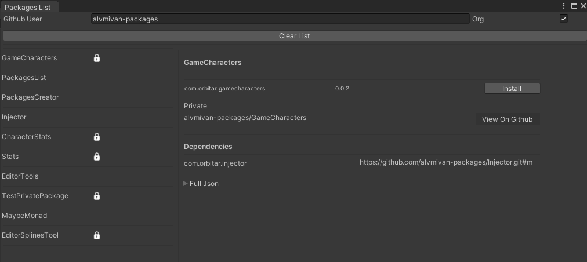

# Packages List



## Overview

### Key Features
* **Holistic Package Overview:** Gain insights into your custom packages, including their installation status, privacy settings, and crucial details.

* **Effortless Installation:** Install packages with a single click, ensuring a hassle-free process for optimal user convenience.

* **Dynamic Updates:** Stay ahead of the curve by effortlessly updating your installed packages to their latest versions, ensuring your project remains cutting-edge.

* **Comprehensive Details:** Dive into the specifics of each package, empowering you with the knowledge to make informed decisions about their usage and integration.

### User-Friendly Interface

* Experience a user-friendly interface that simplifies the package management process, providing you with a visual representation of your packages' status.

* Download now and let the seamless integration of custom packages become a cornerstone of your Unity projects! 😄

## Requirements
- Unity 2021.3 or higher.
- Internet connection for installation and updates.

## Installation
To install PackagesCreator, follow these steps:
1. Open Unity and navigate to `Window > Package Manager`.
2. Click the `+` button and select `Add package from git URL`.
3. Enter the repository URL: `https://github.com/alvmivan-packages/PackagesList.git#release`.
4. Click 'Add' to install the package.

- Alternatively, you can enhance your project's manifest by incorporating this package (on the dependencies section) as follows: `"com.orbitar.packageslist": "https://github.com/alvmivan-packages/PackagesList.git#release"`

## Usage
Once installed, you can access PackagesCreator as follows:
1. Go to `Orbitar > Packages > List` in the Unity menu bar.
2. The Packages List window will open, displaying all your custom packages and their details.

## Github Token Configuration
To ensure the package's functionality, you need to configure your Github token. Here's how to do it:
1. Go to github.com and sign in to your account.
2. Go to [Token Administration Options](https://github.com/settings/tokens) on github and create a new token.
3. Select the `repo` scope to allow the package to access your repositories.
4. Copy your token
5. On your console run the following command:  ```git config --global github.token <your-token> ```
6. You're all set! The package will now be able to access your repositories.


## Explore Packages Creator Tool 😄

Also, don't forget to check out our [Packages Creator](https://github.com/alvmivan-packages/PackagesCreator), allowing you to craft custom packages seamlessly.


## Contributing
To contribute to this project:
1. Fork the repository on [GitHub](https://github.com/alvmivan-packages/PackagesList).
2. Create a new branch for your features or fixes.
3. Submit a pull request with your changes for review.


## More Information
- Author: Marcos Alvarez
- Email: [alvmivan@gmail.com](mailto:alvmivan@gmail.com)
- Current Version: 0.0.4
- Compatible with Unity 2021.3 and later versions.

